# Бизнес-процесс системы "Авиа-сувениры"

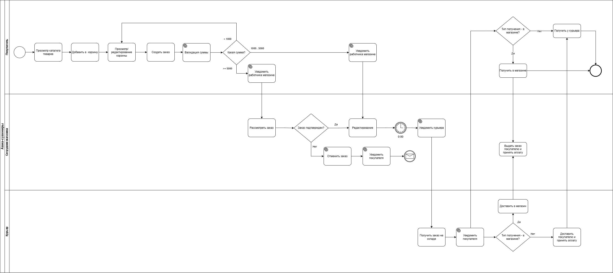

# Объектная модель системы "Авиа-сувениры"

### 1. Сущность: Пользователь (User)

_клиенты и персонал_
_клиенты и персонал_

| Атрибут     | Тип данных | Обязательность | Описание / Бизнес-правило                                    |
| :---------- | :--------- | :------------: | :----------------------------------------------------------- |
| **ID**      | Long       |       Да       | Уникальный системный идентификатор.                          |
| **ФИО**     | String     |       Да       | Полное имя. Обязательно для оформления заказа.               |
| **Телефон** | String     |       Да       | Контактный номер. Используется как логин и уникальный ключ.  |
| **Роль**    | Enum       |       Да       | CLIENT (Покупатель), MANAGER (Сотрудник), COURIER (Доставка) |

### 2. Сущность: Товар (Product)

| Атрибут          | Тип данных | Обязательность | Описание / Бизнес-правило                                                     |
| :--------------- | :--------- | :------------: | :---------------------------------------------------------------------------- |
| **ID**           | Long       |       Да       | Уникальный системный идентификатор.                                           |
| **Наименование** | String     |       Да       | Название авиа-сувенира.                                                       |
| **Цена**         | Decimal    |       Да       | Розничная стоимость за единицу товара.                                        |
| **Остаток**      | Decimal    |       Да       | Остаток товара на складе. Часть может быть в резерве - это товары в OrderItem |

### 3. Сущность: корзина заказов (Cart)

_Служебный объект для временного хранения корзины до заказа._

| Атрибут        | Тип данных     | Обязательность | Описание / Бизнес-правило                 |
| :------------- | :------------- | :------------: | :---------------------------------------- |
| **ID**         | Long           |       Да       | Уникальный системный идентификатор.       |
| **Клиент**     | Link (User)    |       Да       | Ссылка на профиль покупателя.             |
| **Товар**      | Link (Product) |       Да       | Ссылка на конкретную позицию из каталога. |
| **Количество** | Decimal        |       Да       | Количество товара                         |

### 4. Сущность: Заказ (Order)

| Атрибут                | Тип данных  | Обязательность | Описание / Бизнес-правило                                         |
| :--------------------- | :---------- | :------------: | :---------------------------------------------------------------- |
| **ID**                 | Long        |       Да       | Уникальный системный идентификатор.                               |
| **Номер заказа**       | String      |       Да       | Уникальный номер. Генерируется при создании.                      |
| **Клиент**             | Link (User) |       Да       | Ссылка на профиль покупателя.                                     |
| **Статус**             | Enum        |       Да       | NEW, IN_DELIVERY, AWAITING_CONFIRMATION, CANCELLED, COMPLETED     |
| **Метод оплаты**       | Enum        |       Да       | CASH (Наличные), CARD (Картой при получении).                     |
| **Способ получения**   | Enum        |       Да       | HOME (Доставка на дом), PICKUP (В магазин сети)                   |
| **Адрес доставки**     | String      |      Нет       | Обязателен, если выбрано HOME                                     |
| **Сумма заказа**       | Decimal     |       Да       | Рассчитывается автоматически. Должна быть ≥ 1 000 руб.            |
| **Дата создания**      | DateTime    |       Да       | Фиксируется в момент оформления. Лимит редактирования — до 00:00. |
| **Дата подтверждения** | DateTime    |      Нет       | Фиксируется менеджером для заказов от 5 000 руб.                  |
| **Исполнитель**        | Link (User) |      Нет       | Назначенный сотрудник магазина или службы доставки.               |

### 5. Сущность: Позиция заказа (OrderItem)

_Служебный объект для детализации состава заказа._

| Атрибут          | Тип данных     | Обязательность | Описание / Бизнес-правило                                        |
| :--------------- | :------------- | :------------: | :--------------------------------------------------------------- |
| **ID**           | Long           |       Да       | Уникальный системный идентификатор.                              |
| **Заказ**        | Link (Order)   |       Да       | Ссылка на основной заказ.                                        |
| **Товар**        | Link (Product) |       Да       | Ссылка на конкретную позицию из каталога.                        |
| **Цена продажи** | Decimal        |       Да       | Фиксируется в момент заказа. Не меняется при правке справочника. |
| **Флаг подарка** | Boolean        |       Да       | При "True" цена в чеке обнуляется по акции "2+1".                |
| **Количество**   | Decimal        |       Да       | Количество товара.                                               |

---

### Бизнес-логика связей:

1. **User (1) — Order (M)**: Один клиент может иметь неограниченное число заказов.
2. **Order (1) — OrderItem (M)**: Заказ не может существовать без позиций (минимум 1 товар).
3. **Product (1) — OrderItem (M)**: Товар может присутствовать в многих разных заказах.
4. **Product (1) — Cart (M)**: Товар может присутствовать в корзине у многих разных пользователей.

### ER диаграмма

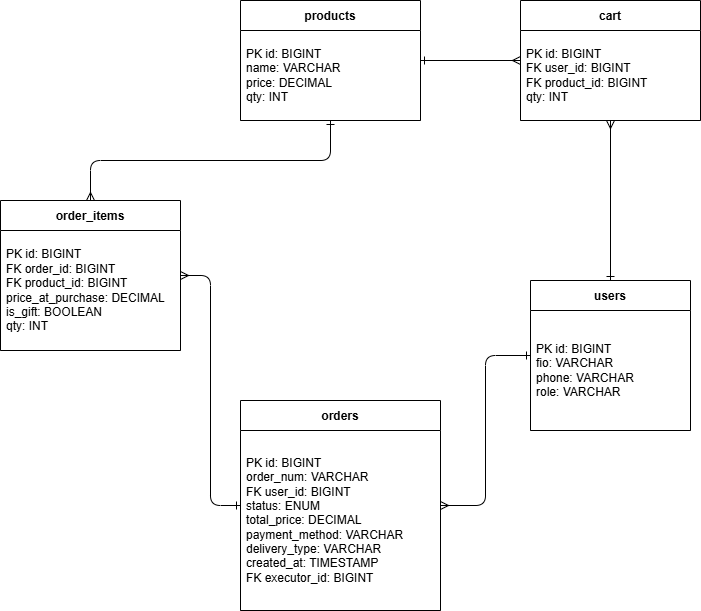

### Физическая модель данных

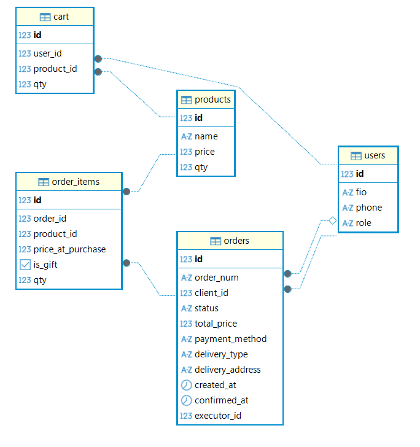

### Алгоритмы по пункту 3 функциональных требований:

[check_order.py](check_order.py)

### SQL-запрос, который вернет три товара с учетом критериев, представленных в п. 6:

[queries.sql](sql/queries.sql)

# Реализация в GreenData

### Предметная область

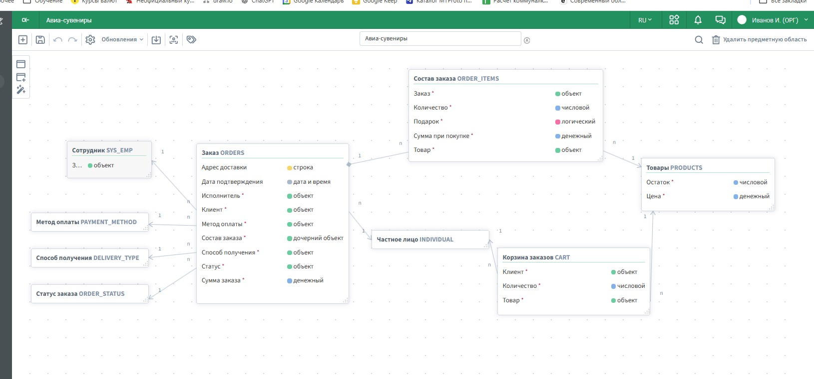

### Настройка объектов и полей

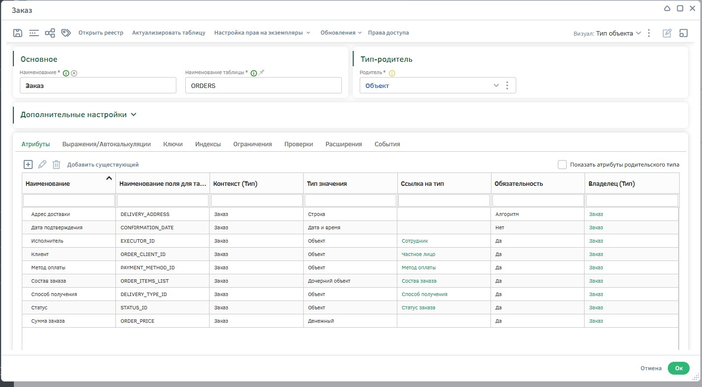
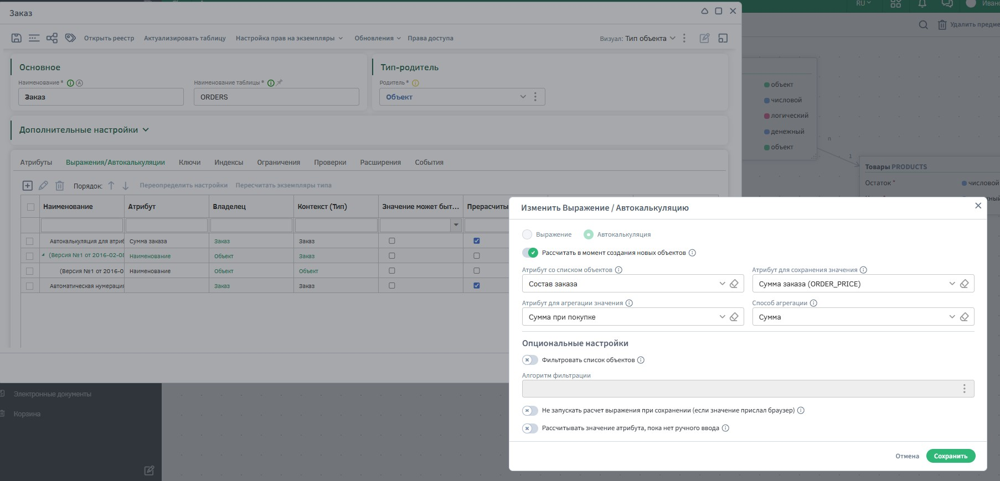
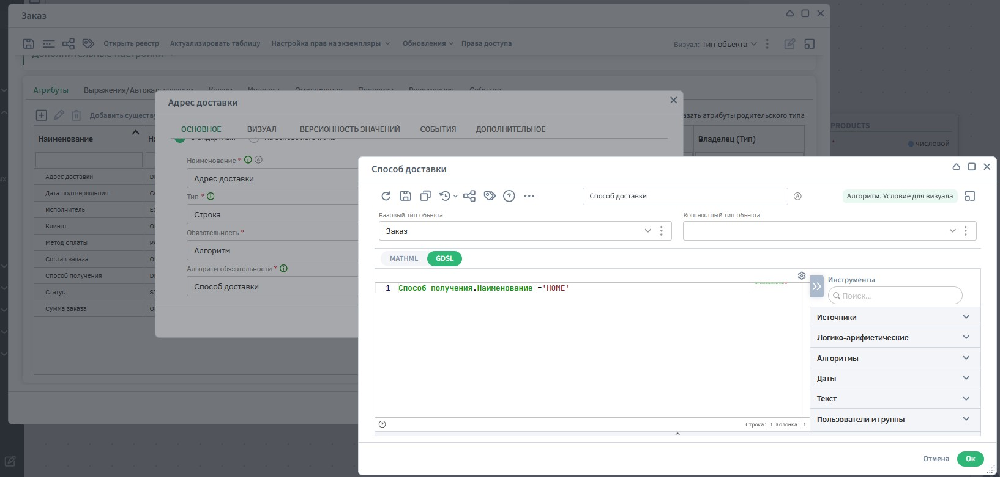

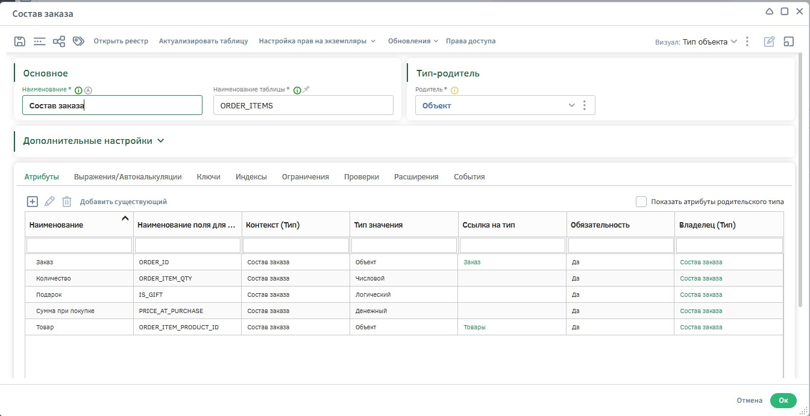
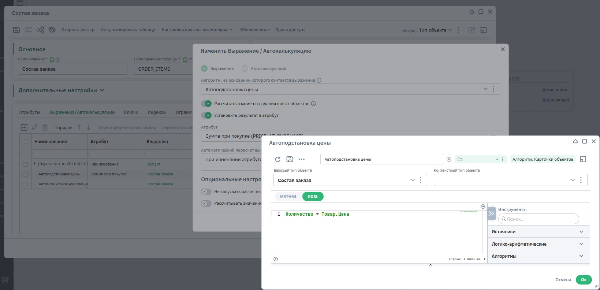

### Визуальные формы ввода

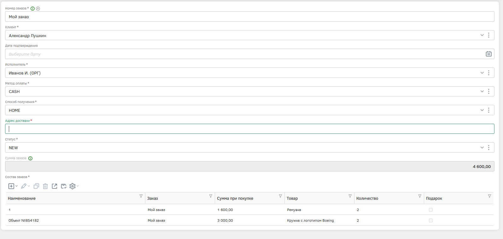

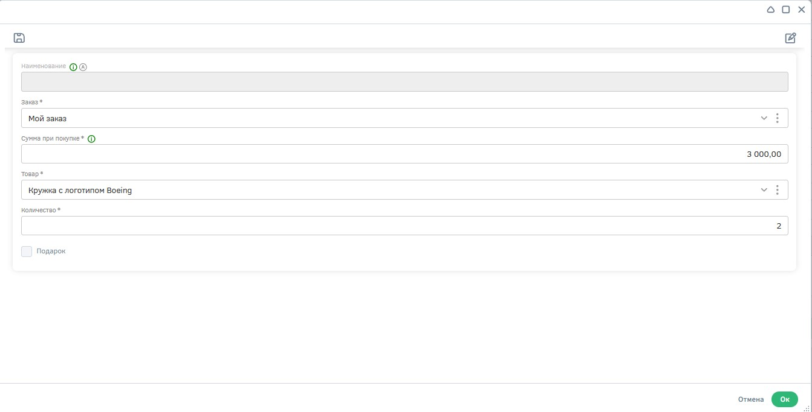
